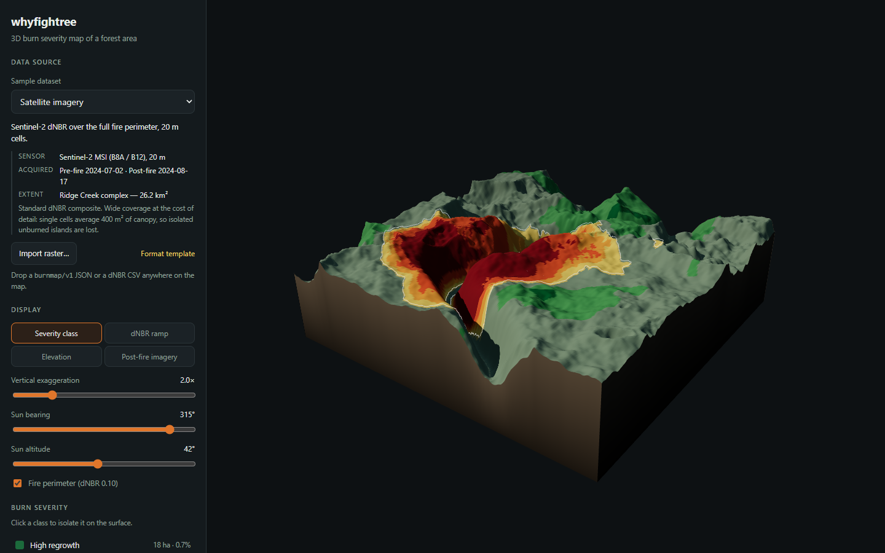

# whyfightree

A three.js burn map: a 3D terrain model of a forest area shaded by **burn severity**, so
the extent and intensity of fire damage can be read at a glance.

**[Open the live map →](https://shubin123.github.io/whyfightree/)**



## What it does

Severity is expressed as **dNBR** (differenced Normalised Burn Ratio) and classified with the
standard USGS / UN-SPIDER breaks, so a map made here is comparable with published burn
severity products rather than being a decorative gradient:

| Class          | dNBR            | Meaning                                            |
| -------------- | --------------- | -------------------------------------------------- |
| High regrowth  | < −0.25         | Canopy denser than before the fire                  |
| Low regrowth   | −0.25 … −0.10   | Slight greening relative to the pre-fire scene      |
| Unburned       | −0.10 … 0.10    | No detectable change                                |
| Low severity   | 0.10 … 0.27     | Surface fuels scorched, canopy largely intact       |
| Moderate-low   | 0.27 … 0.44     | Understorey consumed, patchy canopy scorch          |
| Moderate-high  | 0.44 … 0.66     | Most canopy scorched, heavy fuel consumption        |
| High severity  | > 0.66          | Stand replacing — canopy gone, mineral soil exposed |

On top of that the viewer offers:

- **Four colour modes** — classified severity, a continuous dNBR ramp, hypsometric elevation,
  and a simulated post-fire natural-colour view.
- **The fire perimeter** drawn as an iso-line at the dNBR 0.10 break, extracted with marching
  squares, so the burned boundary is visible even in the elevation and imagery modes.
- **Per-class area statistics** in hectares and percent, plus total mapped area, burned area
  and mean dNBR.
- **Class isolation** — click a legend row to dim everything but that class while keeping the
  burn in its topographic context.
- **Vertical exaggeration and sun position** controls; hill shading is what makes the coupling
  between slope, aspect and severity legible.
- **A hover read-out** giving elevation, dNBR, severity class and ground position.
- **Export** of the current view as a PNG, or of the whole scene as a `burnmap/v1` JSON file.

## Data sources

Three sample datasets ship with the viewer, differing in ground sample distance and extent the
way the real products do:

| Sample                 | Sensor                                  | Cell size | Extent   |
| ---------------------- | --------------------------------------- | --------- | -------- |
| Satellite imagery      | Sentinel-2 MSI (B8A / B12)              | 20 m      | 26.2 km² |
| Aerial photography     | Fixed-wing MicaSense RedEdge            | 5 m       | 1.25 km² |
| Lidar & field plots    | Airborne lidar DTM + 34 CBI field plots | 2 m       | 0.16 km² |

The samples are generated, not downloaded, so the app is self-contained and the tests are
deterministic. The generator is a small fire-behaviour model rather than arbitrary noise: an
elliptical scar stretched downwind from the ignition point, modulated by fuel load, by upslope
run — fire climbs, so slopes facing into the wind burn hotter than the lee side of the same
ridge — and by a drainage that acts as a fuel break.

### Importing your own raster

Use **Import raster…**, or drop a file anywhere on the map. Two formats are read:

- **`burnmap/v1` JSON** — the native format. `dnbr` and `elevation` are row-major arrays of
  `width × height` values; elevation is metres, dNBR is unitless, `cellSize` is metres.
  `public/sample.burnmap.json` is a 32 × 32 template, also linked from the panel.

  ```json
  {
    "format": "burnmap/v1",
    "name": "Ridge Creek",
    "sourceType": "satellite",
    "width": 2,
    "height": 2,
    "cellSize": 30,
    "elevation": [820, 835, 845, 860],
    "dnbr": [0.02, 0.31, 0.58, 0.91]
  }
  ```

- **CSV** — one row per raster row of bare dNBR values. A severity CSV carries no elevation, so
  the terrain renders flat and the map reads as a draped plane.

Anything an export produces can be re-imported unchanged; that round trip is covered by a test.

## Running it

```bash
npm install
npm run dev        # http://localhost:5173
```

Other scripts:

| Script                | What it does                                                     |
| --------------------- | ---------------------------------------------------------------- |
| `npm run build`       | Typecheck, then build to `dist/`                                  |
| `npm test`            | Unit tests (vitest)                                               |
| `npm run lint`        | ESLint, zero warnings tolerated                                   |
| `npm run typecheck`   | `tsc --noEmit`                                                    |
| `npm run smoke`       | Drives real Chrome against a running server (see below)           |
| `npm run template`    | Regenerates `public/sample.burnmap.json`                          |
| `npm run ci`          | Everything CI runs, in order                                      |

## How it is built and shipped

- **No framework.** TypeScript in strict mode (including `noUncheckedIndexedAccess` and
  `exactOptionalPropertyTypes`), Vite for bundling, three.js for rendering.
- **The domain layer holds no three.js.** `src/core/` — grids, noise, the fire model, severity
  classification, the contour tracer and the palettes — is pure and node-testable. `src/render/`
  turns a scene into geometry and lights it; `src/ui/` wires the panel to the renderer. That
  split is why 45 unit tests can cover the parts that decide what the map *says*, leaving only
  the drawing to the browser test.
- **Buffers are updated in place.** Moving the exaggeration slider rewrites the position
  attribute rather than rebuilding geometry, which keeps the 256 × 256 satellite scene
  interactive.
- **Two test layers.** Vitest covers the model and the parsers; `scripts/smoke.mjs` drives a
  real Chrome, asserts that a WebGL context comes up and that the canvas contains a varied
  image rather than a flat background, and saves the screenshot as a build artifact. Both run
  in CI on every push and pull request.
- **Pages deploys from CI.** `.github/workflows/pages.yml` builds `main` and publishes `dist/`
  through the official Pages actions — no `gh-pages` branch, no committed build output.

```
src/
  core/     grid, noise, burn model, severity classes, contours, palettes
  data/     sample scenes, import parsers, export
  render/   terrain surface (geometry + colours), viewer (camera, lights, picking)
  ui/       app wiring, styles
tests/      unit tests for everything in core/ and data/
scripts/    browser smoke test, format-template generator
```

## Licence

MIT © Shubin123. See [LICENSE](LICENSE).
